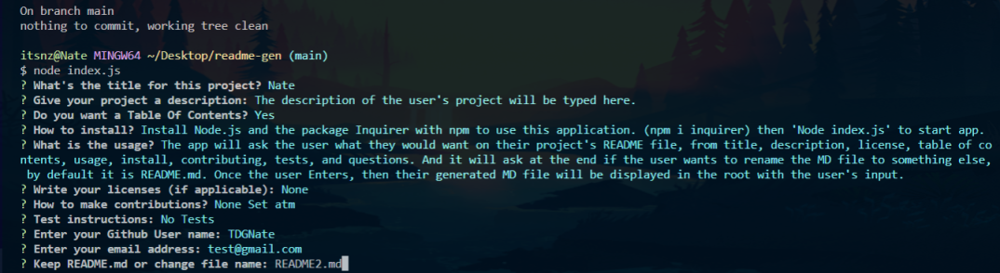

# MarkDown File Generator

Application that allows the user to create a high quality README.md that includes a title, description, table of contents, installation, how to use, license, contributing, testing, and a question section. It's optional to the user if they prefer a Table of Contents, and based on their choice we'll update. User can click the links in the Table of Contents to take the user to that section, and each section is formatted correctly. This README was also created from this application! :)

## Table Of Contents

- [Usage](#usage)
- [Install](#install)
- [Contribute](#contributing)
- [Testing](#tests)
- [Licenses](#licenses)
- [Questions](#questions)

## Usage

The app will ask the user what they would want on their project's README file, from title, description, license, table of contents, usage, install, contributing, tests, and questions. And it will ask at the end if the user wants to rename the MD file to something else, by default it is README.md. Once the user Enters, then their generated MD file will be displayed in the root with the user's input.  
[Video on how to generate README.md file](https://drive.google.com/file/d/1W3VM-vbzFpCu5v2vs04f48AFpCiRKrMU/view)

## Install

Install Node.js and the package Inquirer with npm to use this application. (npm i inquirer) then 'Node index.js' to start app.

## Contributing

Cloning or forking repo

## Tests

No Test

## Example Screenshot

## Bug

_Assertion Failed: argument is undefined or null: Error:_

[Bug Link](https://github.com/microsoft/vscode/issues/105734)

**Solution:** Reload Window

## Questions

_Reach Out!_

TDGNate

itsnzte@gmail.com
